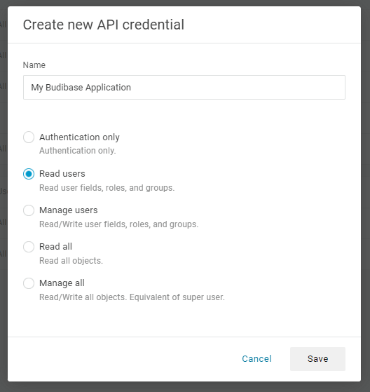
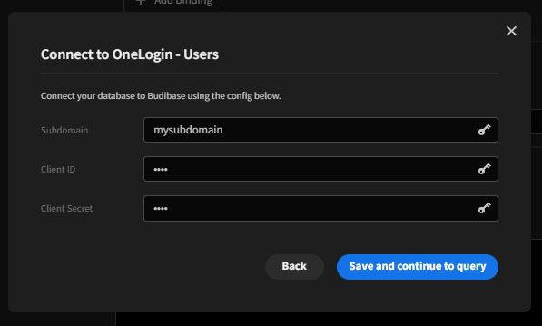
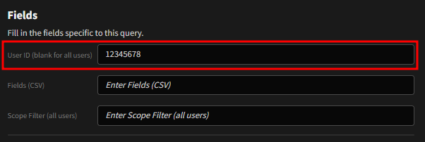
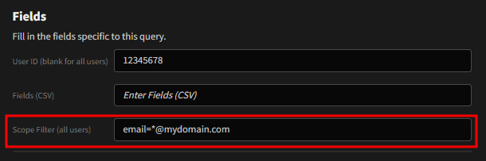
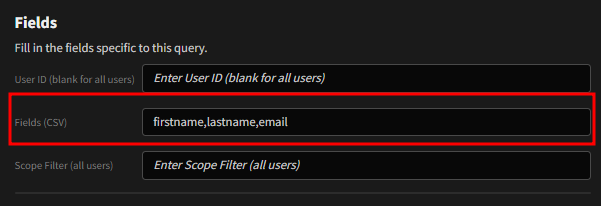
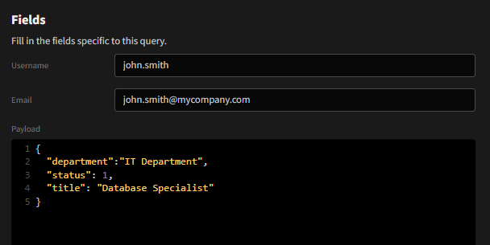
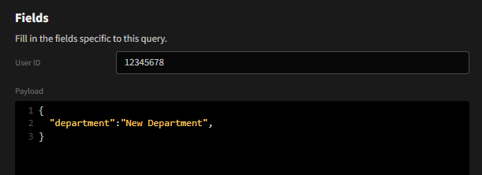
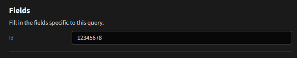

# Budibase - OneLogin User Datasource Plugin
A Budibase plugin to interface with the OneLogin User API

## Reference
Find out more about [Budibase](https://github.com/Budibase/budibase).<br>
OneLogin User API docs: [OneLogin](https://developers.onelogin.com/api-docs/2/users).

## Quick Start
1. Import the plugin into your budibase instance (see Budibase documentation for more info)
2. Generate an API key from your OneLogin Administration Dashboard: [API Credentials](https://greatbigevents.onelogin.com/api_credentials#).

> ### Notes
>    * The API key must have `Manage Users` permissions to operate correctly
>    * If you only want the plugin to read user data, set your API key for `Read Users`
> 

3. Add the plugin as a datasource to your application
4. When prompted to configure the plug, supply your OneLogin subdomain, and your API client ID and secret generated above.
   

## Query: Read
### All users, all data
To retrieve all users from your OneLogin directory, create a `READ` query, leaving all fields blank

### Specific User
To retrieve a specific user, specify the OneLogin directory ID


### Search for User
Specify the parameters and value to search in the Scope field.<br>
You can use wildcards to search for user(s) that match conditions; eg: *@mydomain.com

* This will cause any value in the `User ID` field to be ignored.

### Specific Fields
You can specify which fields you want returned into your schema by specifying them in the `Fields` field, using CSV

* Fields must be comma separated
* Do not include a space between fields/attributes

## Query: Create a user
You must specify a username and email as minimum attributes.<br>
Additional attributes can be populated at creation time by specifying them in the payload field.


> *Note:* a user is created as a deactivated account by default.<br>
> To make the account active at creation, specify `"status": 1` in the payload.

## Query: Update a User
You must specify the OneLogin Directory ID of the user you want to update.<br>
This can be obtained using the `READ` query, scoped to the users email address or other identifying attribute.<br>

The fields to be updated for the user are specified as key value pairs in the payload.<br>
Fields not specified will not be updated or changed.


## Query: Delete a User
You must specify the OneLogin Directory ID of the user you want to delete.<br>

**<span style="color:red">NOTE: THIS CANNOT BE UNDONE. Please validate the User before executing the query.<br></span>
It is HIGHLY recommended you show your end user a confirmation as part of your UI design when using this query.**



## Local build instructions
To build your new  plugin run the following in your Budibase CLI:
```
budi plugins --build
```